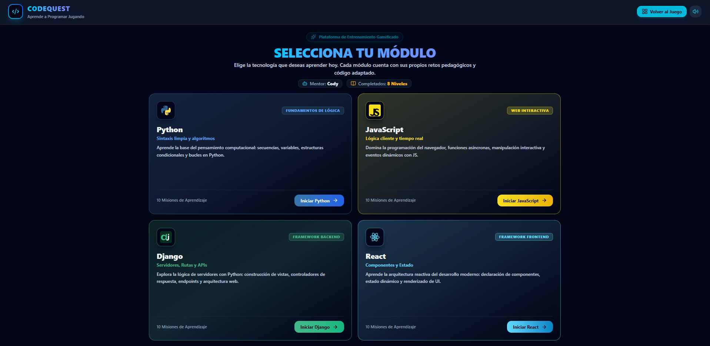
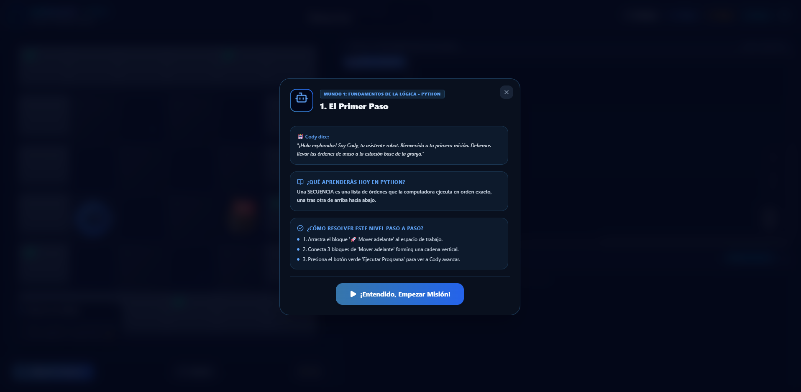
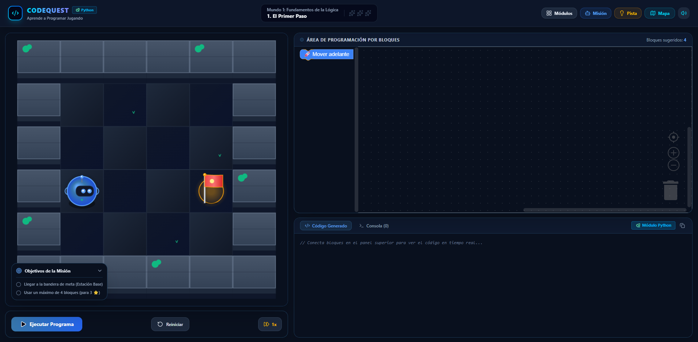
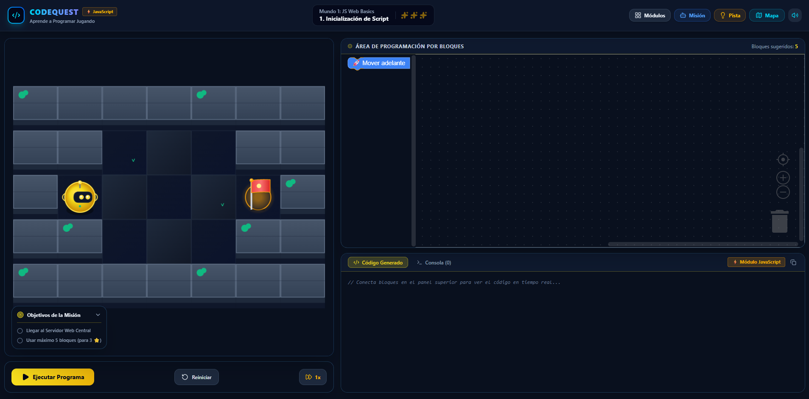
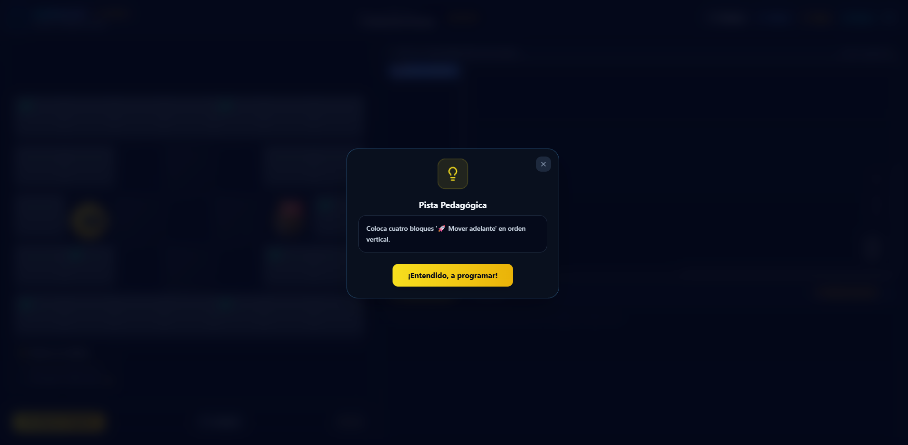
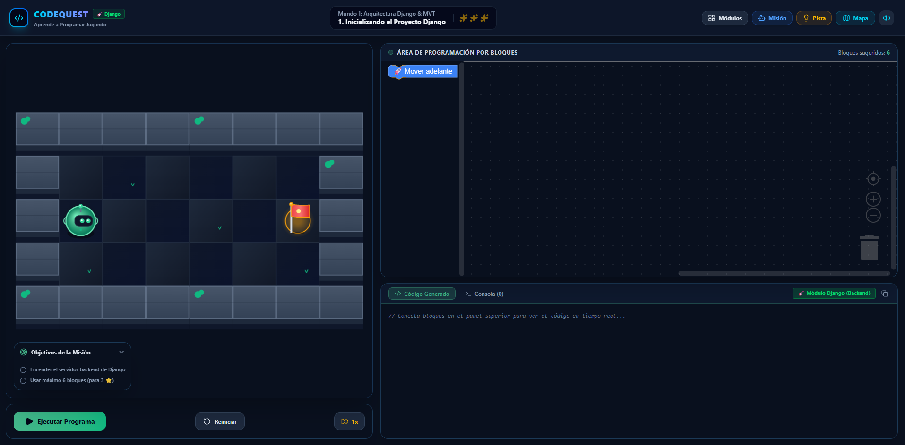
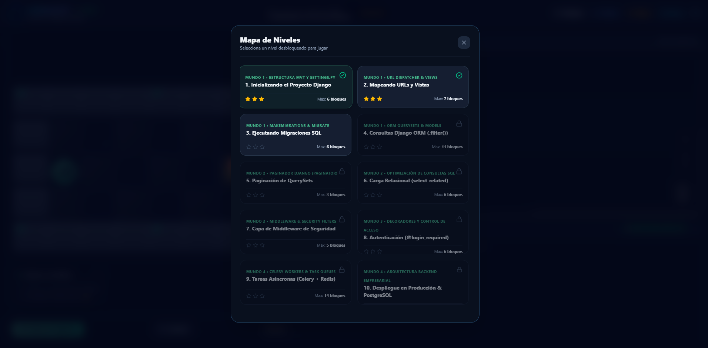
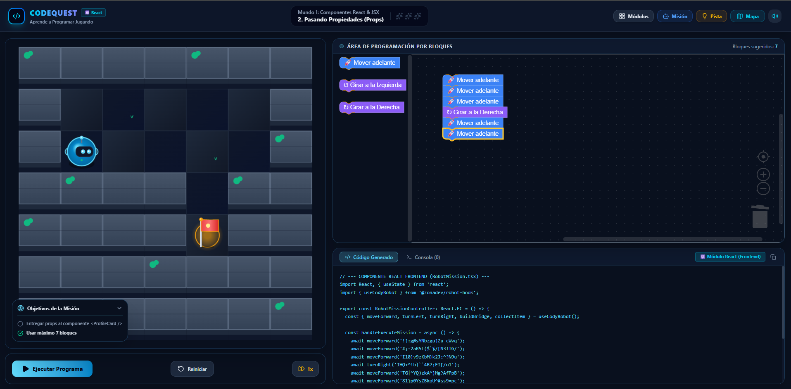
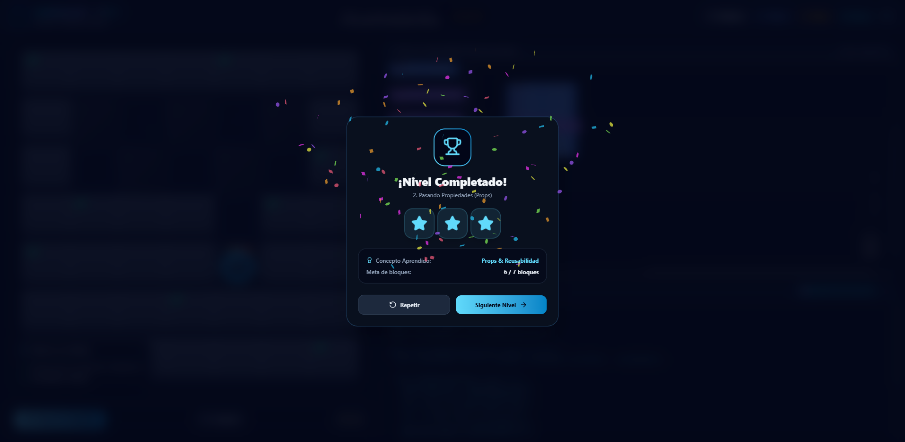

  <h1> ZonaDev</h1>
  
<strong>Plataforma Gamificada de Aprendizaje de Programación por Bloques y Código Real</strong>

  

    
    
    
    
    
  

   

---

## 🌟 Sobre ZonaDev

**ZonaDev** es un entorno interactivo y gamificado diseñado para enseñar fundamentos de programación y desarrollo web moderno. A través de un mapa interactivo en 2D, los estudiantes guían al bot **Cody** resolviendo misiones lógicas que combinan la programación por bloques visuales con la generación y vista previa de código fuente real.

---

## 🎮 Módulos de Aprendizaje

| Módulo | Enfoque Principal | Misiones | Conceptos Clave |
| :---: | :--- | :---: | :--- |
| **🐍 Python** | Fundamentos de Lógica | **10** | Secuencias, Giros, Acciones en Entorno, Bucles y Condicionales |
| **⚡ JavaScript** | Web & Ciberespacio | **10** | Ejecución Síncrona, Rutas API, WebSockets, Tokens JWT y Event Loop |
| **🟢 Django** | Backend Framework | **10** | Arquitectura MVT, Modelos SQL, Consultas ORM, Middleware y Celery |
| **⚛️ React** | Frontend Framework | **10** | Componentes JSX, Props, Estado (`useState`), `useEffect` y Virtual DOM |

---

## ✨ Características Destacadas

- 🧩 **Editor Visual Blockly**: Programación por bloques intuitiva con traducción instantánea a código Python y JavaScript.
- 🗺️ **Mundos y Mapas 2D**: Canvas interactivo con físicas de grilla, recolección de ítems y construcción de infraestructura.
- ⚡ **Animaciones Fluidas**: Modalidades e interfaz potenciadas con GSAP para una experiencia inmersiva.
- ⭐ **Evaluación Algorítmica**: Sistema de calificación por estrellas según optimización y cantidad de bloques utilizados.
- 💾 **Persistencia de Progreso**: Guardado automático de logros, misiones desbloqueadas y récords en almacenamiento local.

---

## 📸 Galería Visual de la Plataforma

| | |
|:---:|:---:|
|  |  |
|  |  |
|  |  |
|  |  |

 

---

  
Creado con ❤️ para potenciar la educación tecnológica gamificada.

